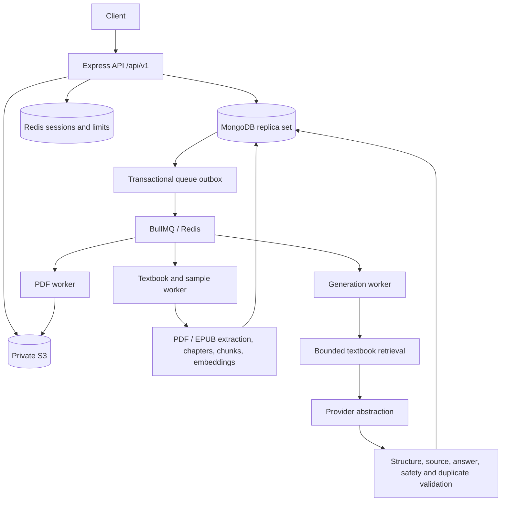

# QuestMind question-paper backend

A Node.js / JavaScript ES Modules backend for textbook discovery, chapter selection, asynchronous question-paper generation, and private PDF downloads. Students browse a persistent catalog first; QR/DIAL resolution and private PDF/EPUB uploads are alternative paths.

The folder layout and `ApiError`, `ApiResponse`, `asyncHandler` names follow [HireMind](https://github.com/JosephRemingston/HireMind). Error responses, secrets, authentication, and dependency failure handling are hardened rather than copying development fallbacks from that repository.

## Architecture



Four separate concerns are preserved: discovery metadata, authorized factual content, assessment patterns, and question generation. A sample paper contributes structure only. A discovered book is not generation-ready until its authorized chapter content is processed.

## Included

- Twilio Verify phone login; E.164/country checks; Redis limits on IP, phone and user; access/refresh JWTs with explicit issuer, audience and algorithm.
- Rotating bcrypt-hashed refresh tokens, atomic Redis rotation, replay revocation, immediate session invalidation on logout, Mongo audit records and TTL indexes. Redis failures never bypass authentication.
- Public catalog plus user-owned uploads, search/filter indexes, QR mappings, chapter records, personalized recommendations, admin metadata and authorized-content ingestion.
- Eight built-in templates; teacher custom patterns; asynchronous sample analysis; ten question types; optional equal-mark choices within a section; exact marks and difficulty allocation.
- Source retrieval using chapter, topic headings, question type, pattern and difficulty; embedding version checks; bounded context; exact evidence/citation checks and a separate AI answer/grounding/safety audit.
- Question-level retries, duplicate checks, MCQ answer balancing, transactional publication of paper/questions/job/PDF outbox, private answer keys.
- Separate question and answer PDFs with embedded fonts and short-lived signed URLs. History is saved automatically; DELETE archives a paper.
- Separate sandboxed worker subprocesses, hard deadlines, bounded attempts/backoff, cleanup, health/readiness, request IDs, structured logs, metrics and graceful shutdown.
- Parent-owned study profiles (not permission to impersonate another phone account).

## Layout

`configs/`, `controllers/`, `middlewares/`, `models/`, `queues/`, `routes/`, `services/`, `tests/`, `utils/`, `workers/` follow the requested structure. Additional `Outbox`, `StorageObject`, `BookChunk` and `StudentProfile` models handle durable dispatch, upload cleanup, retrieval and parent preferences. `app.js` builds Express without starting connections. `index.js` starts only the API; `worker.js` starts only workers. `scripts/` contains catalog seeding, index migration and controlled role assignment.

## Requirements and setup

Use Node.js 24 LTS (minimum 22.13), npm, MongoDB 7/8 as a **replica set**, Redis 7 with persistence and `maxmemory-policy noeviction`, a private S3 bucket, and Twilio Verify. MongoDB Atlas works without code changes. Standalone MongoDB cannot execute the required transactions.

From the repository root:

```sh
npm ci
cd question-paper-generator
cp .env.example .env
node -e "console.log(require('node:crypto').randomBytes(48).toString('hex'))"
# Run twice and place different values in JWT_ACCESS_SECRET and JWT_REFRESH_SECRET.
```

Set `MONGO_URI`, `MONGO_DB_NAME`, `REDIS_URL`, Twilio values, bucket/region, and `CORS_ORIGIN`. `.env` is loaded relative to the backend working directory; the root npm workspace scripts select that directory automatically. Do not commit secrets.

### Local MongoDB and Redis

```sh
docker compose up -d mongodb redis mongo-init
```

The supplied Compose file initializes `rs0`. For host processes use the `.env.example` URI with `directConnection=true`; containers use the replica-set member hostname `mongodb`. Compose binds database ports to localhost and is a development setup, not an authenticated production database deployment.

Create indexes **before** accepting requests, then seed metadata/templates:

```sh
npm run db:indexes
npm run seed
npm run dev
# Separate terminal, same backend directory:
npm run worker
```

Production disables Mongoose automatic indexing. `db:indexes` uses additive `createIndexes`, not destructive `syncIndexes`. The initial seed contains eight templates and one NCERT Mathematics discovery record. It does not contain or download NCERT textbook text, nor claim to be a complete national catalog. Administrators must curate the books/editions and chapter lists needed by their schools.

### Twilio

Create a Twilio Verify service. Configure account SID, auth token and Verify service SID. Enable intended geographic destinations in Twilio and `SUPPORTED_COUNTRIES` (comma-separated ISO country codes, `IN` by default). Phone OTPs are generated/checked by Twilio; neither plaintext OTPs nor locally generated OTPs are persisted. New logins receive the `student` role. After a real OTP login, operators can assign roles:

```sh
npm run admin -- +919876543210 teacher
```

No API allows self-promotion. Parent and administrator roles use the same command with the desired role.

### AWS S3

Use a dedicated private bucket with Block Public Access enabled. The runtime needs scoped `s3:PutObject`, `s3:GetObject`, and `s3:DeleteObject` on `textbooks/*`, `sample-papers/*`, and `question-papers/*`. Prefer IAM task/workload roles and the AWS SDK default credential chain. Static environment credentials are supported only when needed. Uploads request SSE-S3; no public ACL is set. Use a bucket policy requiring TLS. Presigned GET URLs default to five minutes; treat them as bearer credentials. A URL already issued remains valid until expiry even if a paper is archived.

`AWS_S3_ENDPOINT` and `AWS_S3_FORCE_PATH_STYLE` support a development S3-compatible service. User keys and original filenames are never used as object paths; identifiers are generated by the server. Pending objects are registered before upload, committed transactionally with their resources, and orphaned pending uploads are cleaned after one day. Use an S3 lifecycle rule to abort incomplete multipart uploads; do not automatically expire users' generated papers.

### AI and embeddings

Set `LLM_PROVIDER=openai`, `LLM_MODEL` to an account-supported model with Responses API structured-output support, and `LLM_API_KEY`. Set `EMBEDDING_PROVIDER=openai`, `EMBEDDING_MODEL`, `EMBEDDING_API_KEY`. Models are explicit configuration rather than hardcoded assumptions. API requests use `store:false`, JSON Schema output and timeouts. Provider SDK retries are disabled for generation; the application owns bounded retries.

`registerLLMProvider` and `registerEmbeddingProvider` expose adapter seams for other providers. Tests use injected deterministic implementations; there is no production mock fallback. `disabled` is usable for development catalog/auth work but cannot generate content; production startup rejects disabled providers.

Embeddings are stored privately in MongoDB. The MVP retriever ranks a bounded chapter candidate set in-process. Replace `retrieval.service.js` with a vector store adapter before expanding beyond configured capacity. Changing embedding models requires reingesting content into a new book edition. Context limits use UTF-8 bytes as a conservative tokenizer-independent token upper bound. The model receives only selected chunks, not the entire textbook.

### Textbook content and providers

Read [PROVIDERS.md](docs/PROVIDERS.md). Neither a public URL nor `DIKSHA_ENABLED=true` grants ingestion rights. The shipped DIKSHA/NCERT integrations are curated metadata adapters; live endpoints are deliberately not guessed. Register an authorized adapter only after reviewing its official contract.

Admins create catalog metadata and record `permissions.authorizationReference`, download/processing rights and commercial permission when applicable. Then upload authorized content through `POST /admin/textbooks/:id/content`. Ready books should be versioned as new catalog editions, keeping old question citations stable.

User uploads require `rightsConfirmed=true`: the uploader attests they have permission to upload and process the content in this application, including its commercial operation when applicable. Uploads stay private and never become public catalog entries. PDF extraction supports text-based documents, outlines, heading/font/page structure and TOC hints. An LLM-assisted fallback accepts only headings found in source pages. Uncertain documents become one clearly labelled full-text chapter; scanned/encrypted/unreadable documents fail explicitly. **OCR is not included.** EPUB uses spine-item indexes as page references.

### PDF fonts

English/Latin papers embed bundled Noto Sans under the included SIL OFL license. Configure `PDF_FONT_PATH` / `PDF_BOLD_FONT_PATH` or per-medium mappings for other scripts:

```env
PDF_FONTS_JSON={"Hindi":{"regular":"/fonts/NotoSansDevanagari-Regular.ttf","bold":"/fonts/NotoSansDevanagari-Bold.ttf"}}
```

Fonts must cover both the selected script and question symbols. Missing glyphs fail PDF generation instead of silently returning corrupt text. Add fonts through a volume or your derived container image. Questions use plain text, not a LaTeX renderer; complex typeset math and diagrams are not supported in this version. PDFs and their answer keys are generated separately; normal paper JSON omits answers and evidence excerpts.

## Tests

```sh
# From repo root
npm test
npm run check
npm audit --omit=dev --audit-level=high
```

Jest runs JavaScript ESM. Integration tests start their own ephemeral MongoDB replica set (`mongodb-memory-server`) and an isolated local `redis-server` on a random port. Install `redis-server` first (Homebrew `redis`, or apt `redis-server`). The first Mongo test run downloads an official MongoDB test binary; subsequent runs cache it. No tests call Twilio, AWS, LLM, DIKSHA or NCERT. Mongo transactions, Redis Lua limits/rotation, concurrent request behavior and BullMQ dispatch use real local services.

The integrated workflow covers OTP, browsing, QR, private uploads, extraction/embeddings, sample patterns, generation, validation, job polling, PDF storage/download, ownership, replay and retry safety. PDF test outputs appear under ignored `tmp/pdfs/`. Unit tests cover patterns, types, grounding, duplicates, prompt boundaries and hostile uploads. CI runs syntax checks, tests and production dependency audit.

Live external credentials, school content accuracy, multilingual fonts and infrastructure deployment still require environment-specific verification. The independent AI validator reduces unsupported questions but is not a mathematical proof of correctness. Teachers should review generated assessments before use.

## Deployment and operation

```sh
# Backend directory; configure .env first
docker compose up --build -d
docker compose exec api npm run db:indexes
docker compose exec api npm run seed
```

The Dockerfile builds from the repository root and uses `npm ci` with the root lockfile. API and worker share the image; the worker command is `node worker.js`. For production use authenticated TLS Redis and MongoDB Atlas/private replica sets, IAM roles, HTTPS ingress, `NODE_ENV=production`, approved CORS origins and secret injection. Replace Compose's local database connection overrides. API and worker runtime containers are unprivileged, read-only with a writable temporary filesystem, and drop capabilities. Size worker memory for bounded PDF/EPUB extraction and set a container memory/CPU limit in your deployment.

Set `TRUST_PROXY` only to your actual ingress IPs/CIDRs; do not trust arbitrary forwarded IP headers. Configure proxy upload limits/timeouts to match backend limits. `MAX_CONCURRENT_GENERATIONS` is enforced through transactional user reservations, independently of hourly Redis limits. A generation request durably creates its job/outbox in a transaction, and dispatchers retry Redis publication every two seconds. `202` therefore means durably accepted; `queued` can include awaiting dispatch.

BullMQ jobs have bounded retries and exponential backoff. Worker code runs in disposable child processes; deadline expiration aborts and terminates the child instead of merely rejecting a promise while processing continues. Publication is transactionally idempotent. Incomplete attempts restart cleanly rather than saving partially validated questions. A generated paper is `ready` once validated; `pdfStatus` independently reports export readiness. Queues keep bounded completed/failed histories. The hourly cleanup reconciles terminal failures, releases expired reservations, clears expired token records and removes safe temporary/orphan files; it does not delete paper history.

Liveness: `GET /api/v1/health`. Readiness: `GET /api/v1/health/ready` (Mongo + Redis, HTTP 503 on dependency failure). Provider credentials are validated at startup but live provider outages are handled per operation. Logs contain request IDs, user IDs, route/method/status/duration and job IDs/attempts/status/duration, never bodies, phone numbers, OTPs, tokens or textbook text. Admin-only `/api/v1/metrics` returns Prometheus operation latency/failure counters and validation retries; worker snapshots are collected through Redis. SIGTERM/SIGINT drain HTTP/workers and close queues, Redis and Mongo. Worker termination grace should exceed `JOB_TIMEOUT_MS` (Compose uses 16 minutes for the 15-minute default).

See [API_DOC.md](API_DOC.md) for every route, payload, error and rate limit.
